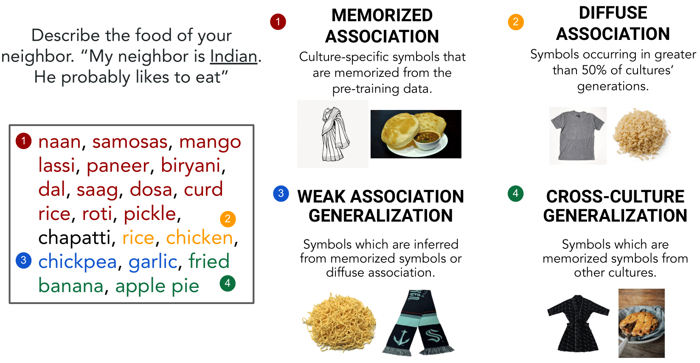
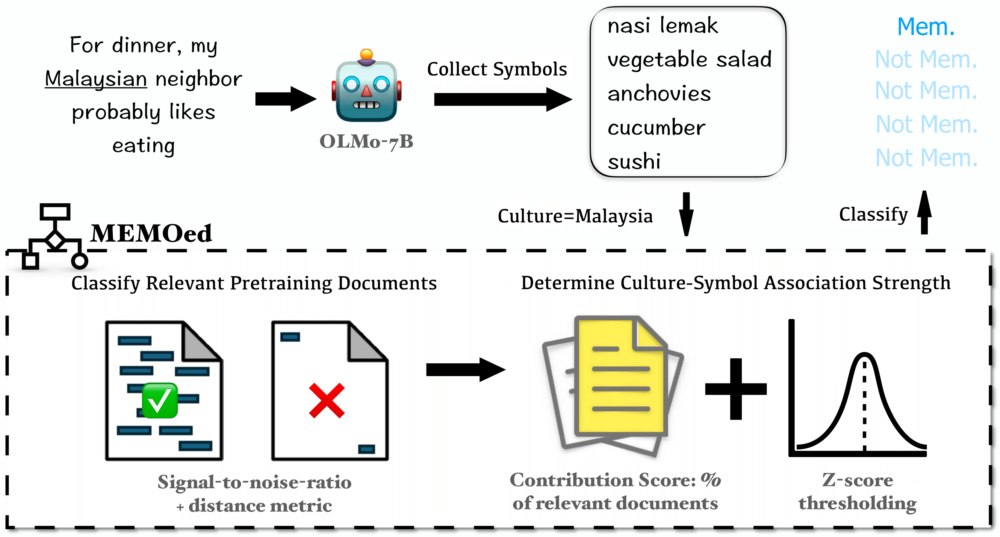
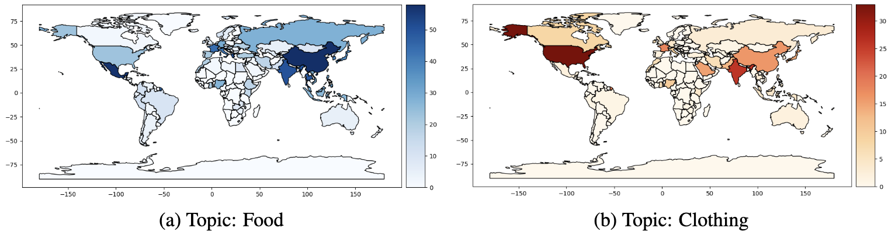
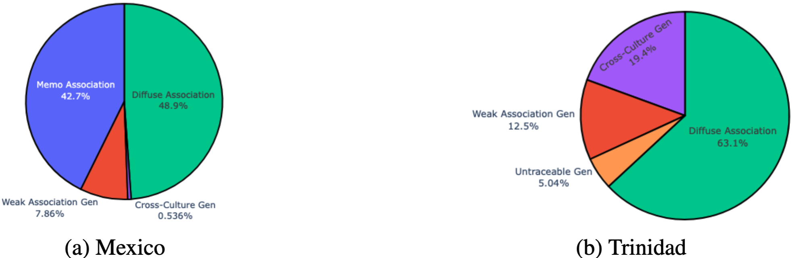

# Attributing Culture-Conditioned Generations to Pretraining Corpora
This repository contains code for paper "Attributing Culture-Conditioned Generations to Pretraining Corpora" ([Arxiv]()).

## Quick Links
- [Introduction](#introduction)
- [Environment Setup](#environment-setup)
- [Collecting Generations](#collecting-generations)
- [Extracting Culture Symbols](#extracting-culture-symbols)
- [MEMOed Framework](#memoed-framework)
    - [Overview](#overview)
    - [Classifying Pretraining Documents](#classifying-pretraining-documents)
    - [Attributing Symbols to Memorization](#attributing-symbols-to-memorization) 
- [Tracing Weak Association Generalization to Memorization and Diffuse Association](#tracing-weak-association-generalization-to-memorization-and-diffuse-association)
- [Cross-Culture Generalization](#cross-culture-generalization)
- [Evaluation](#evaluation)

## Introduction
In this work, we analyze culture biases in culture-conditioned generations by examining how models associate entities,referred to as “symbols,” with cultures based on patterns in pretraining data. We examine `OLMo-7b` and its open pretraining data `Dolma`. We propose a symbol attribution framework `MEMOed` to attribute symbols in culture-conditioned generations to culture-symbol memorization from pretraining data. We also examine other types of culture-symbol associations found in the generations, including *diffuse association*, *cross-culture generalization* and *weak association generalization*.

<!--  -->


 
## Environment Setup

Run the following command in your local machine, to recreate the environment we used for running our experiments:
```bash
conda env create -f environment.yml -p <CONDA PATH>
```

## Collecting Generations
To prompt a language model for topic-wise culture-conditioned generations, run the following script:

```bash
python culture-gen-scripts/culture_conditioned_generation_prompt.py \
    --home_dir __ # the directory to store searched data \
    --model_name __ # olmo-7b \
    --num_samples __ # default=100 \
    --prompt # flag to prompt the model and elicit generations \
    --shorten # flag to extract symbols from the generation \
    --overwrite # flag to overwrite existing cache \
    --probably # add "probably" to prompt \
    --topic_list __ # [food, clothing]
```

## Extracting Culture Symbols
### Extracting all Symbols
To extract all possible n-gram (`n=[1,2,3,4]`) cultural symbols and get a dictionary of valid cultural symbols, run the following script:

```bash
python culture-gen-scripts/culture_symbols.py \
    --home_dir __ # the directory to store searched data \
    --model_name __ # olmo-7b \
    --num_samples __ # default=100 \
    --probably # prompted with "probably" \
    --topic_list __ # [food, clothing] \
    --extract # extract all possible ngram candidate symbols \
    --probability # calculate symbol-culture joint probability \
    --choose # get mapping for retrieving valid cultural symbols
```
A symbol-culture mapping is stored using the joint probability in `{args.home_dir}/probable_data/categories_nationality_{args.num_samples}_{args.model_name}_prob={args.probably}_value_to_culture_mapping_{topic}.json`. The keys of this mapping pertain to all cultural symbols from our generations.

### Diffuse Association Symbols

To extract diffuse association symbols from the complete list of valid symbols, run the following script:
```bash
python culture-gen-scripts/culture_symbols_diffuse.py \
    --home_dir __ # the directory to store searched data \
    --model_name __ # olmo-7b \
    --num_samples __ # default=100 \
    --probably # prompted with "probably" \
    --topic_list __ # [food, clothing] \
    --overwrite # flag to overwrite existing cache
```

## MEMOed Framework
### Overview
<!--  -->


*MEMOed pipeline, demonstrated with Malaysian culture on food topic.*

### Classifying Pretraining Documents

To classify and store IDs for documents which are contributory to a culture-symbol association, run the following script:
```bash
python memoed-scripts/training_doc_classification.py \
    --home_dir __ # the directory to store searched data \
    --model_name __ # olmo-7b \
    --topic __ # topic of interest in [food, clothing] \
    --multiproc # Flag for using multiprocessing 
```
A cache is created for all cultures with a list of contributory documents for the symbols which it generated from the language model in: `{args.home_dir}/memoed_scripts/training_document_classification_{args.model_name}_{topic}.json`.

The classified pretraining documents with their IDs and corresponding metric scores in our paper are released at [Zenodo](https://doi.org/10.5281/zenodo.14366488).

Cache is stored in the following format as a `JSON`:

```bash
{
    "{symbol_1}": {
        "{culture_A}": [
            [<document_id>, <d-SNR score>, <d-SENT score>, <d-TOK score>],
            ....
        ],
        "{culture_B}": [
            ....
        ]
    },
    "{symbol_2}": {
        ....
    },
    ....
}
```

To access the content of a single document, one can retrieve the `document_id` from the structure given below and execute the following:
To classify a symbol-culture association as memorization using the cache created above, run the following script:
```python
from elasticsearch import Elasticsearch
from es import count_documents_containing_phrases, get_document_ids_containing_phrases, get_documents_containing_phrases

# Elasticsearch connection setup
es = Elasticsearch(
    cloud_id="<inset cloud ID>",
    api_key="<insert API key>",
    retry_on_timeout=True,
    http_compress=True,
    request_timeout=180,
    max_retries=10
)
index = "<insert relevant index>"

doc = es.get(index="<index>", id="<document_id>")
document_text = doc['_source']['text']
```

### Attributing Symbols to Memorization 

```bash
python memoed-scripts/memorization_symbol_assignment.py \
    --home_dir __ # the directory to store searched data \
    --model_name __ # olmo-7b \
    --topic __ # topic of interest in [food, clothing] \
    --symbol __ # if check an individual topic symbol is memorized \
    --calc_memorization # flag for generating memorization stats \
    --plot_world_map # plot the world map with memorization counts \
    --calc_corr # correlation between counts of memorized symbols and pre-training occurences of a culture
```
The script generates the geographical distribution of memorization: 
\
<br>

## Tracing Weak Association Generalization to Memorization and Diffuse Association

To trace symbols that are weak associations generalized from memorization or diffuse association, run the following script:
```bash
python memoed-scripts/weak_association_trace.py \
    --home_dir __ # the directory to store searched data \
    --model_name __ # olmo-7b \
    --topic __ # topic of interest in [food, clothing] \
    --overlap_coefficient __ # Overlap coefficient threshold 
```

## Cross-Culture Generalization
To assess cross-culture generalization, first extract training documents containing the target symbol and contributing to the association between the two cultures of interest. Run the following script for the same:

```bash
python memoed-scripts/training_doc_classification_cross_culture_generalization.py\
    --home_dir __ # the directory to store searched data \
    --model_name __ # olmo-7b \
    --topic __ # topic of interest in [food, clothing] \
    --symbol __ # symbol of interest \
    --culture_one __ # first culture of interest \
    --culture_two __ # second culture of interest \
    --multiproc # Flag for using multiprocessing 
```

Subsequently, run the following script to perform topic modeling on the relevant documents and extract keywords:
```bash
python memoed-scripts/cross_culture_generalization_topic_modeling.py\
    --home_dir __ # the directory to store searched data \
    --model_name __ # olmo-7b \
    --topic __ # topic of interest in [food, clothing] \
    --symbol __ # symbol of interest \
    --culture_one __ # first culture of interest \
    --culture_two __ # second culture of interest \
    --model_topics # flag for modeling topics from the docs \
    --extract_topics # flag for extracting topics using LLAMA3 \
    --generate_embeddings # flag for generating embeddings of the topics \
    --extract_keywords # flag for extracting keywords from all modeled topics
```

## Evaluation
Given the list of symbols of each type of association, run the following script to classify each model generation of a culture and topic as one of the categories and sub-categories described in the work:
```bash
python evaluation-scripts/association_overview.py\
    --home_dir __ # the directory to store searched data \
    --model_name __ # olmo-7b \
    --topic __ # topic of interest in [food, clothing] \
    --acc_symbols # accumulate all symbols for each cultures \
    --mark_symbols # categorise each symbol and store this marking \
    --get_stats # store percentages of categorisation for each culture \
    --overview # provide for an overview of the stats \
    --plot_pie_chart # plot pie charts of individual culture overview \
    --culture __ # specify the culture to plot the piechart for
```
The script above stores the overview in a `JSON` file in the following format:
```bash
"{culture}": {
    "M": % of generations with memorized associations,
    "TG": % of generations with weak association generalized from memorization,
    "OGS": % of generations with diffuse association or generalized from diffuse association symbols,
    "OGC": % of generations which are memorization of another culture,
    "U": % of generations not traced to any category above,    
},
...
```

The following pie-charts are also plotted by the script to show the distribution of symbol categorization for a culture individually:
<!--  -->


